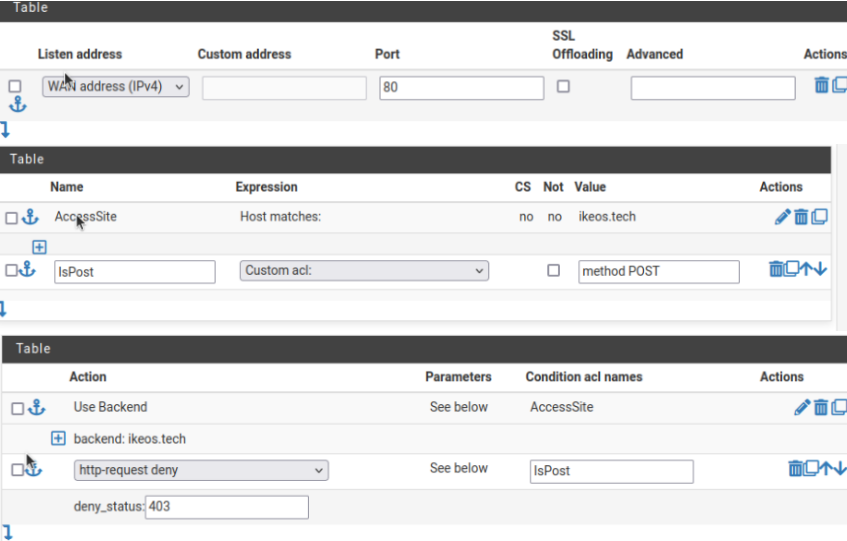
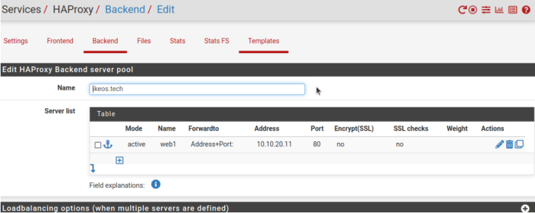
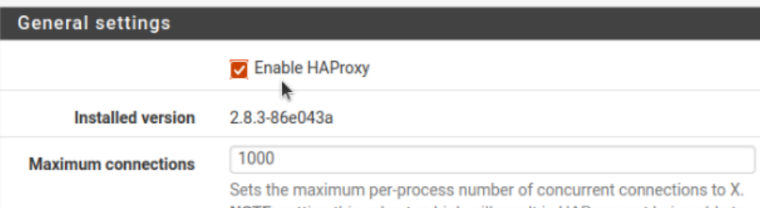
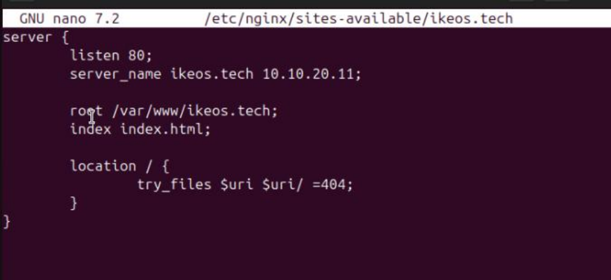
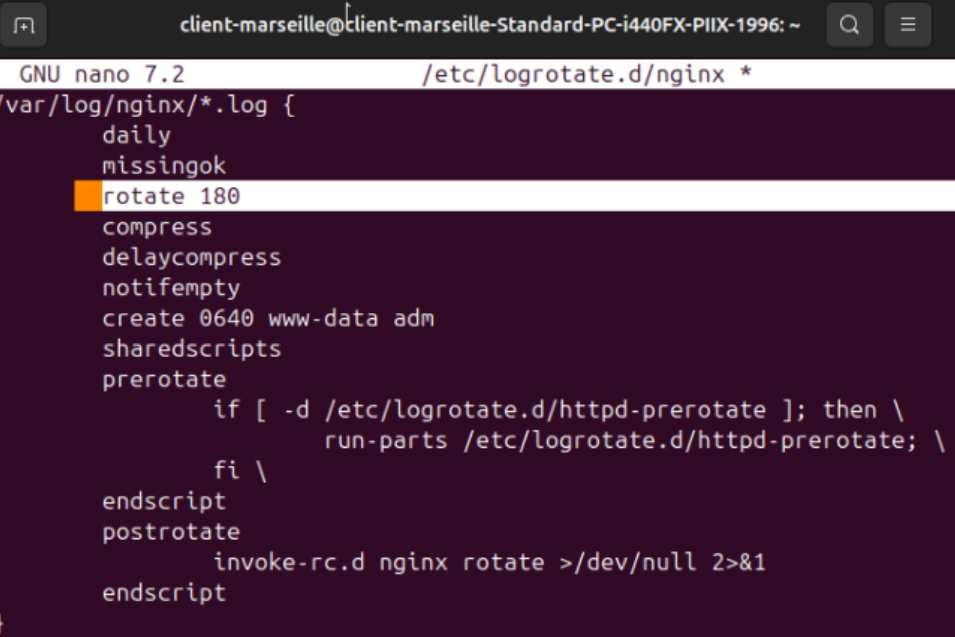
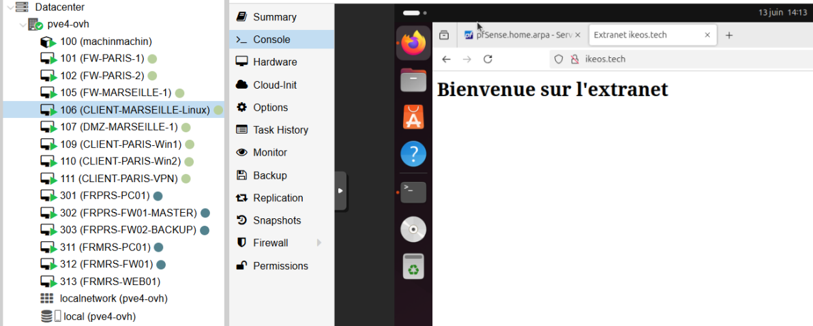
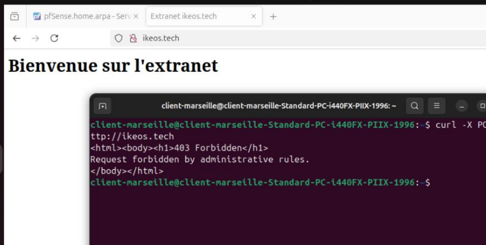

# 🛡️ DMZ

## 🎯 Objectif

L’objectif de la **DMZ (Demilitarized Zone)** sur le site de **Marseille** est de publier en toute sécurité l’extranet client de l’entreprise sur Internet, tout en protégeant le réseau interne.  
La DMZ est un **réseau isolé**, séparé du LAN, où sont placés les serveurs accessibles depuis l’extérieur (ici le *reverse proxy* et le serveur web).

Cette architecture permet de **limiter les risques en cas de compromission** : même si un serveur de la DMZ était attaqué, l’attaquant ne pourrait pas accéder directement aux systèmes internes de l’entreprise.

La DMZ agit donc comme une **zone tampon entre Internet et le réseau privé**, renforçant la sécurité périmétrique et réduisant la surface d’exposition des ressources critiques de l’entreprise.

Les exigences sont les suivantes :
- Exposer le site en **HTTP (port 80)**.
- Placer le **reverse proxy** derrière le firewall (utilisation de *HAProxy*).
- **Bloquer certaines méthodes HTTP** (le *POST* est spécifiquement interdit).
- Héberger le **serveur web dans la DMZ**.
- **Activer la journalisation** du trafic de navigation.

---

## 🔐 Certificat Let's Encrypt via ACME

⚙️ Ces étapes ne sont **pas réalisables dans la maquette** : le déploiement se fait donc sans HTTPS dans cet environnement de test.

👉 Pour l'installation en production du certificat Let's Encrypt, se référer à la documentation suivante :  
[pfSense : Reverse Proxy HTTPS avec HAProxy et ACME Let's Encrypt](https://www.it-connect.fr/pfsense-reverse-proxy-https-avec-haproxy-et-acme-lets-encrypt/)

---

## ⚙️ Configuration de HAProxy

Après avoir installé le module **HAProxy** sur notre pare-feu à Marseille, nous configurons les règles d’accès.

### 🔹 Frontend
- Création d’un **frontend basé sur l’adresse WAN**.
- Configuration des règles permettant l’accès au site.
- Blocage de la méthode **HTTP POST**.

### 🔹 Backend
- Configuration du **backend** pointant vers le serveur web de la DMZ.
- Adresse IP du serveur : `10.10.20.11` (dans la DMZ).
- Port utilisé : **80 (HTTP)**.

### 📝 Journalisation
- Activation de la journalisation dans HAProxy.
- Cette journalisation vient en complément des logs du serveur web, configurés dans l’étape suivante.

✅ Une fois la configuration terminée, **HAProxy est activé**.

## 🌐 Mise en place du serveur WEB

Nous déployons ensuite un **serveur NGINX** sur le serveur de la DMZ afin de tester le bon fonctionnement du reverse proxy.

- Installation de **NGINX**.
- Configuration de NGINX pour que le site cible soit le site actif.

### 📝 Configuration des logs
- Modification des logs par défaut de NGINX pour qu’ils soient conservés **par tranche de 6 mois (180 jours)**.

## ✅ Résultats

Nous avons réussi à **accéder au site depuis un client** (ici le poste situé à Marseille, mais cela fonctionne également avec les autres clients).

### 🚫 Vérification du blocage de la méthode POST
Une simple requête **POST** effectuée depuis un client est **immédiatement bloquée** et retourne une **erreur 403**.

---

✔️ L’objectif est donc atteint :  
Le site est accessible via HTTP, la méthode POST est bloquée, la journalisation est active, et la DMZ sécurise l’environnement.
