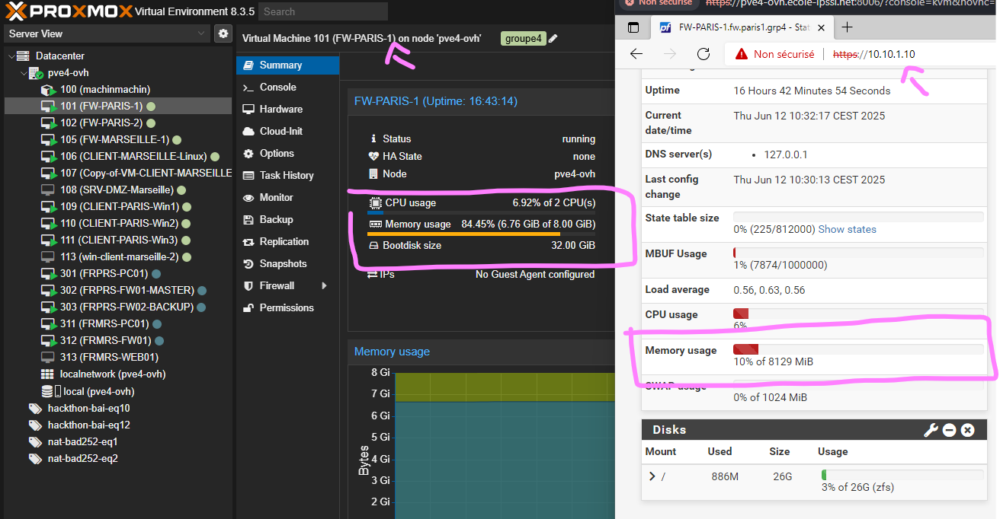
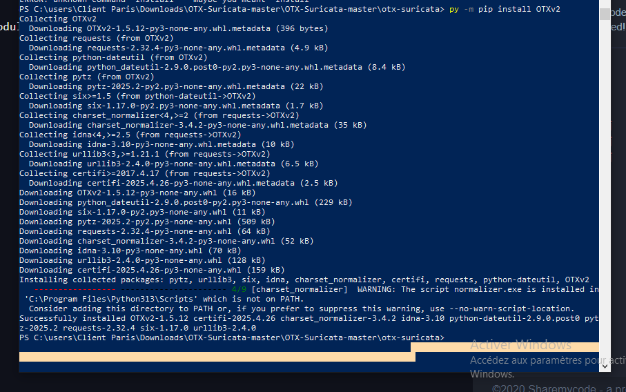
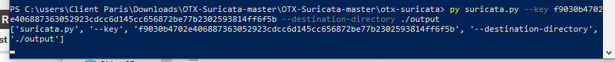
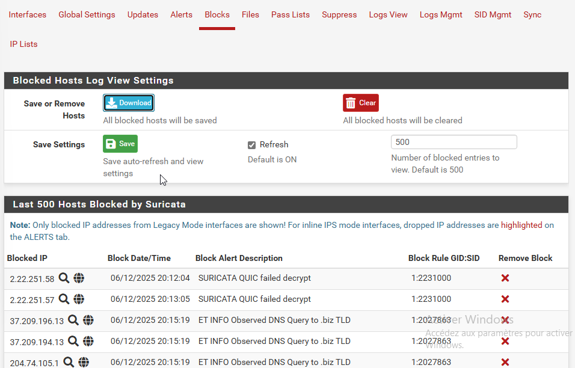
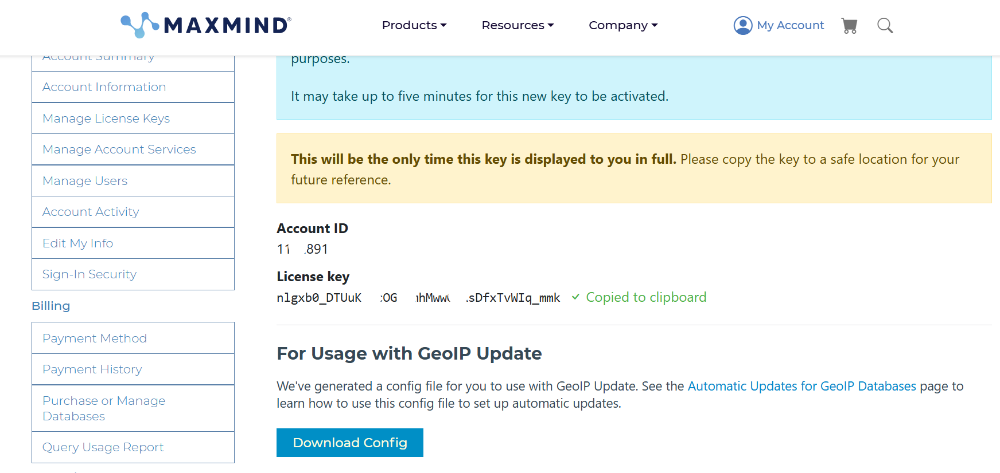

# IDS/IPS – Suricata

## 📌 Intérêt d’un IDS/IPS
Un IDS/IPS (Intrusion Detection System / Intrusion Prevention System) permet de détecter et, si nécessaire, bloquer de manière proactive les tentatives d’intrusion ou de compromission sur le réseau.
Il vient en complément d’un pare-feu classique.

> 🔒 Un pare-feu applique des règles statiques : il bloque ou autorise les flux réseau selon les IP, les ports, ou les protocoles, mais il n’analyse pas en profondeur les paquets.

Un IDS/IPS permet de détecter des attaques complexes telles que :

- Des tentatives de scan de ports

- Des attaques par force brute

- Des signatures connues de malwares

- Des tentatives d’exploitation de failles applicatives

- Des accès vers des destinations malveillantes ou interdites

Suricata inspecte les paquets réseau en profondeur et les compare à une base de signatures d’attaques connues et à des règles comportementales.

## Avantages :
- Détection en temps réel des activités suspectes ou malveillantes

- Blocage automatique des flux jugés dangereux

- Journalisation des tentatives d’intrusion pour une analyse a posteriori

> Ce dispositif a été configuré pour surveiller l’interface WAN (trafic Internet entrant/sortant) ainsi que le tunnel VPN inter-sites pour sécuriser les échanges entre les sites.

# ⚙️ Mise en place de Suricata
Vérification de la RAM
Proxmox affiche un pourcentage de la RAM allouée à pfSense, mais ce n’est pas la RAM réellement utilisée.
Pour vérifier la consommation exacte, il faut se rendre sur le tableau de bord pfSense.



## Installation de Suricata
Accès : System > Package Management > Package Installer

.png)  

Une fois l’installation terminée, configurer Suricata sur l’interface WAN.

- Activation : OK  
- Interface : WAN

.png) 

## 🔐 Configuration initiale
Nous devons surveiller les connexions et bloquer les IP provenant de pays spécifiques : Russie, Ukraine, Chine, Corée du Nord.

Pour bloquer automatiquement les menaces, cocher Block Offenders.

.png) 

Vérification des IP bloquées via :
`Services > Suricata > Blocked Hosts` 

.png) 

Dans la partie Categories, sélectionner les catégories souhaitées (liées aux règles WAN).

.png) 

> Les règles peuvent être désactivées en cas de faux positifs trop fréquents.

## Qu’est-ce que la réputation IP ?
La réputation IP est une évaluation basée sur le comportement passé d’une adresse IP (ex : spam, malwares, scans de ports).

.png) 

Les scores sont attribués par des bases reconnues comme :

- AbuseIPDB  
- Talos Intelligence  
- Autres organismes de cybersécurité

👉 **Activation fortement recommandée.**

.png)

# 📥 Ajout de la liste d’IP malveillantes
Deux options :

- Créer sa propre liste
- Télécharger une liste existante

Nous avons utilisé OTX-Suricata (outil open source).

**Étapes :**
1. Générer une clé API sur otx.alienvault.com

.png) 

2. Installer OTXv2 (module nécessaire - Python requis).

3. Télécharger :

- `reputation.list` (liste d’IP malveillantes)  
- `categories.txt`(fichier de correspondance des catégories)

Créer un dossier `output` dans le répertoire `otx-suricata`.

Importer les fichiers dans :
`Services > Suricata > IP List`

4. Installation OTXv2 module pour lecture du script. 

> ⚠️ Attention : j'ai eu besoin d'installer Python avant pour pouvoir installer OTXv2

 

5. Téléchargement des IPs réputation / réputation.list et catégories.txt
Création d'un dossier `output` dans le dossier otx-suricata

 

## 📂 La structure du fichier reputation.list :

- **IP**  
- **Catégorie** (référencée dans `categories.txt`)  
- **Score** de réputation (de 1 à 127)

.png) 

## ➕ Ajout de la règle OTX
Ajout dans le fichier `otx_iprap.rules.`

Règle :


``` html
alert ip $HOME_NET any -> [OTX_IPS] any (msg:"OTX - Connexion vers IP malveillante détectée"; threshold:type limit, track by_src, count 1, seconds 60; sid:500001; rev:1;)
```

> Cette règle génère une alerte si une machine interne tente de se connecter à une IP malveillante avec un score de menace > 30.

.png) 

## 🚫 Blocage des pays à risque

Règle :
```html
drop ip [RU,CN,UA,KP] any -> $HOME_NET any (msg:"BLOCK - Connexions entrantes de pays à risque (RU, CN, UA, KP)"; geoip:src,RU,CN,UA,KP; sid:500002; rev:1;)
```

**Explications :**

- **drop** ip : Bloque le trafic IP 
- **[RU,CN,UA,KP]** : Pays ciblés (Russie, Chine, Ukraine, Corée du Nord)  
- **$HOME_NET** : Réseau local (WAN ici)  
- **geoip:src** : Filtrage basé sur la géolocalisation IP

.png) 

## ✅ Vérifications finales
Vérifier que Suricata fonctionne via :
`Status > Services`

.png) 

Pour consulter les alertes :
`Services > Suricata > Alerts`
Sélectionner l’interface WAN.

.png) 
   

Vérification de la base GeoIP
Sur pfSense, vérifier que la base MaxMind est bien en place.

.png) 
 

## 🔄 Déploiement sur le firewall de Paris (HA)
Répétition de la procédure pour le firewall de Paris (mode HA).

<br>
<br>

# 🔍 Pare-feu de Marseille : Configuration spécifique
TAN Consulting demande :

- Filtrage de la navigation Internet  
- Journalisation des logs sur une période minimale de 6 mois

**Configuration :**
Dans Logs Mgmt de Suricata :

- **Activer** : Log Directory Size Limit  
- **Allouer** : Espace disque pour les logs  

**Calcul de l’espace nécessaire :**
- 900 Mo / mois  
- Sur 6 mois : environ 5,4 Go

🛑 **Choix final** : Allocation de 10 Go pour assurer une marge confortable (environ 1 an de rétention).

# 📦 Matériel

**Firewall** : Netgate 4200 MAX  
**Stockage** : 128 Go  
Allocation de 10 Go pour les logs Suricata sans contrainte.
> Suricata conserve les logs jusqu’à saturation des 10 Go, puis supprime les plus anciens.

 

## 🔧 Spécificité Marseille vs Paris
Seule différence : Paramétrage des logs (espace disque)

Suppression des règles non demandées sur le firewall de Marseille

## 🔎 Amélioration : Monitoring

👉 Pour améliorer la supervision des firewalls, j'ai installé un agent **Wazuh** après la fin du projet (optionnel, non demandé dans le cahier des charges).


La documentation arrive bientôt...

