# VPN Client-to-Site

## Objectif 🎯

Le VPN client-to-site permet aux utilisateurs nomades (télétravailleurs, prestataires, cadres en déplacement) d’accéder de manière sécurisée au réseau interne du site de Paris.

Ce VPN établit un tunnel chiffré entre le poste distant de l’utilisateur et le firewall de Paris, garantissant la **confidentialité, l’authentification et l’intégrité des communications**, même depuis des réseaux publics (Wi-Fi d’hôtel, 4G, etc.).

Il permet aux collaborateurs de retrouver un accès sécurisé aux ressources internes (applications métiers, serveurs de fichiers, intranet), tout en respectant les bonnes pratiques de sécurité (**authentification forte, filtrage des accès**).

## Mise en place 🛠️

### Création de la CA (Autorité de Certification)

Avant de mettre en place un serveur VPN, il est essentiel de créer une **Autorité de Certification (CA)**.  
Cette autorité signe les certificats numériques utilisés pour sécuriser les connexions VPN et garantit que seuls les utilisateurs autorisés peuvent établir une connexion sécurisée.

- Accès à l’interface pfSense :  
  **System > Cert. Manager > CAs**

- Création d’une nouvelle CA : `CA-OPENVPN`

#### Avantages :
- Contrôle total sur la gestion des certificats (création, révocation, durée de validité, etc.).
- Évite de recourir à une autorité externe souvent payante.
- Indispensable pour générer les certificats serveur et utilisateur pour OpenVPN.

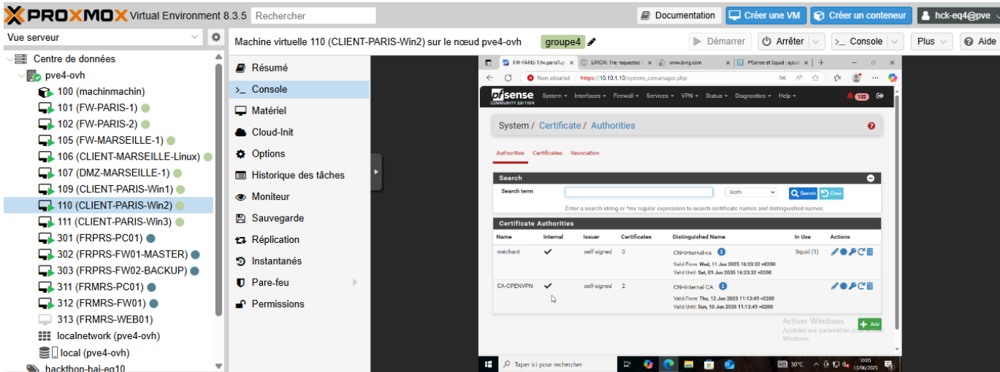

---

### Création du certificat serveur OpenVPN

- Accès :  
  **System > Cert. Manager > Certificates > Add/Sign**

#### Paramètres :
- **Method :** Create an internal certificate (certificat signé par notre CA interne)
- **Descriptive name :** OPENVPN CERT
- **Certificate Type :** Server Certificate
- **Certificate Authority :** CA-OPENVPN
- **Key length :** 4096 bits
- **Digest Algorithm :** SHA256

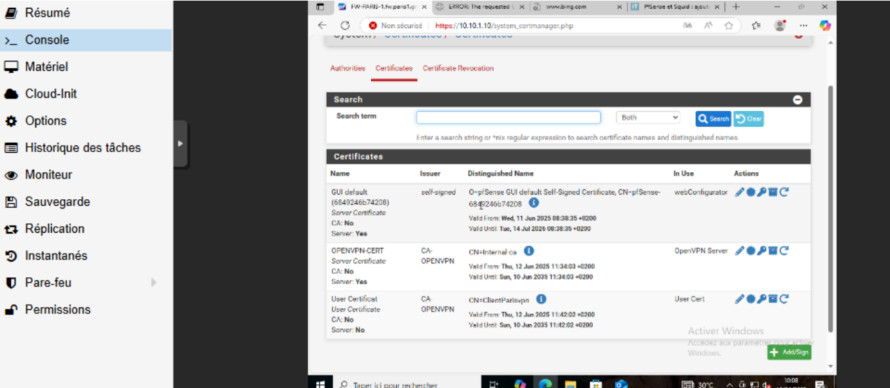

 

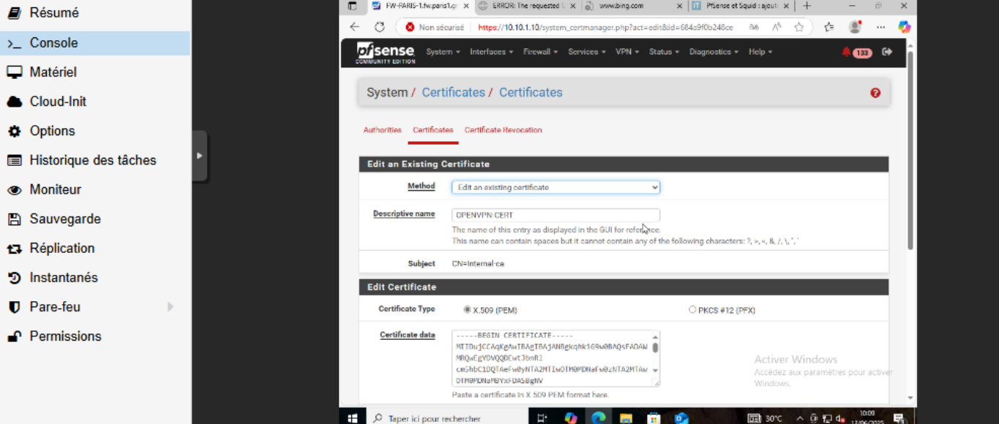

---

### Configuration du serveur OpenVPN (Client-to-Site – Site de Paris)

- **Interface :** WAN (connexion externe autorisée)
- **Protocole :** UDP (meilleure performance VPN)
- **Port :** 1194 (port standard OpenVPN)

#### Réseaux configurés :
- **Tunnel Network :** 10.99.0.0/24 (plage IP dédiée VPN)
- **Local Network :** 10.10.1.0/24 (réseau interne site de Paris)

#### Mode d'authentification :
- **Remote Access (SSL/TLS + User Auth)**  
  Double authentification : certificat + identifiants (nom d’utilisateur/mot de passe)

#### Paramètres de sécurité :
- **Chiffrement :** AES-256-GCM, AES-128-GCM, CHACHA20-POLY1305
- **Algorithme de hachage :** SHA256
- **Diffie-Hellman :** 2048 bits

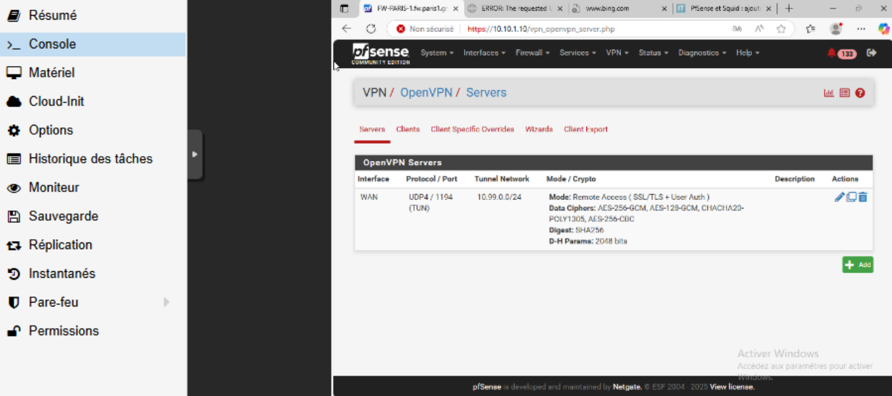

 

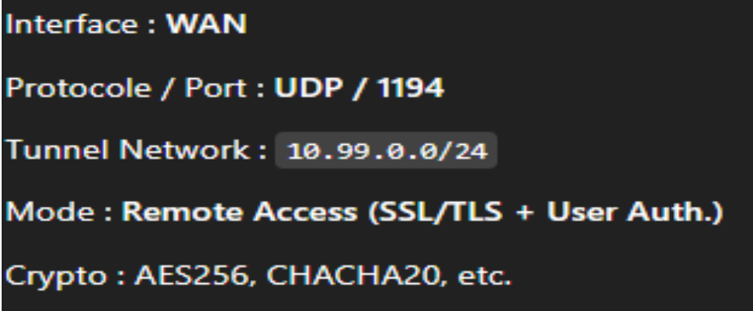

---

### Création d’un utilisateur VPN

- **Nom d’utilisateur :** ClientParisvpn
- **Mot de passe sécurisé attribué**
- **Certificat utilisateur généré**

#### Pourquoi chaque utilisateur doit avoir son propre certificat ?
- Traçabilité des connexions
- Contrôle individualisé des accès
- Révocation ciblée si nécessaire

#### Pourquoi utiliser une CA interne ?
- Contrôle total et sécurité renforcée
- Évite l’usurpation d’identité via des certificats tiers

---

### Export des profils clients OpenVPN

- Nécessité d’un fichier de configuration `.ovpn` personnalisé (incluant l’adresse du serveur, le port, les certificats, etc.)

#### Étapes :
1. **Installer le package :** `openvpn-client-export`  
   *Accès :* System > Package Manager > Available Packages > openvpn-client-export
2. **Exportation :** VPN > OpenVPN > Client Export

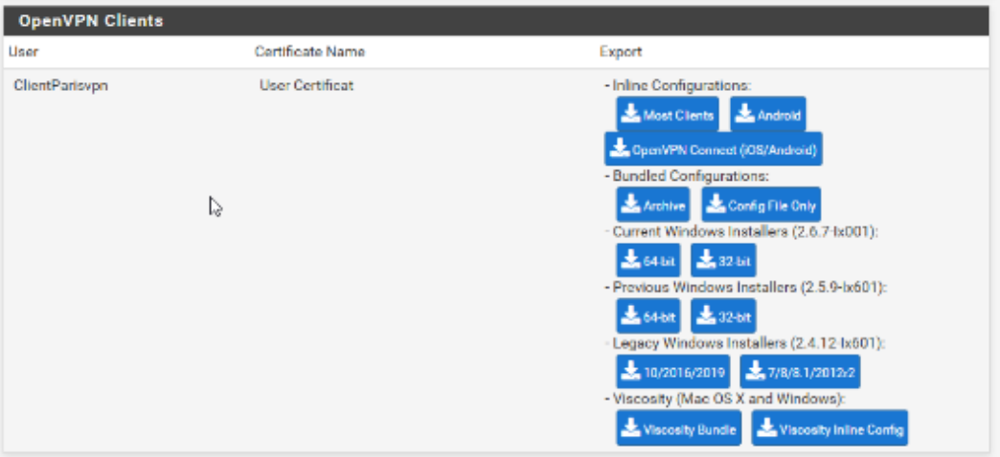

---

### Connexion avec OpenVPN GUI

- Démarrer le logiciel **OpenVPN GUI**
- Faire **clic droit > Exécuter en tant qu’administrateur**
- Copier le fichier `.ovpn` dans :  
  `C:\Program Files\OpenVPN\config`

#### Connexion :
- Faire **clic droit > Connecter** sur le profil VPN
- Saisir les identifiants : nom d’utilisateur et mot de passe

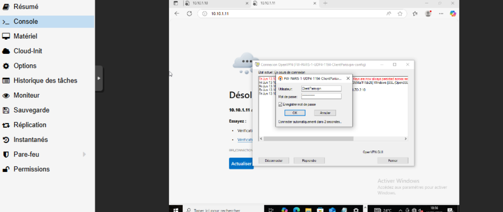

- Option : cocher "Mémoriser le mot de passe" pour les futures connexions

---

### Vérification de l’activation du VPN

- Une **icône verte** dans la barre des tâches confirme la connexion active.
- Possibilité de consulter les journaux via l’icône OpenVPN.

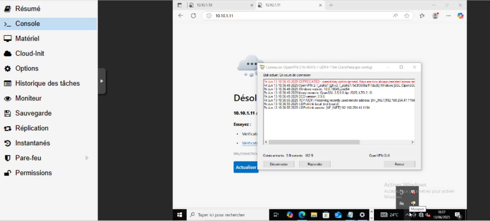

---

### Configuration des règles de pare-feu

#### WAN :
- **Accès :** Firewall > Rules > WAN

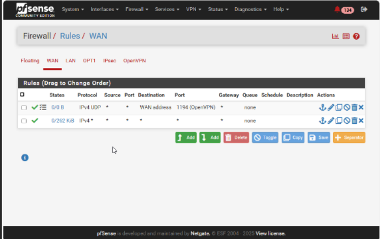

 

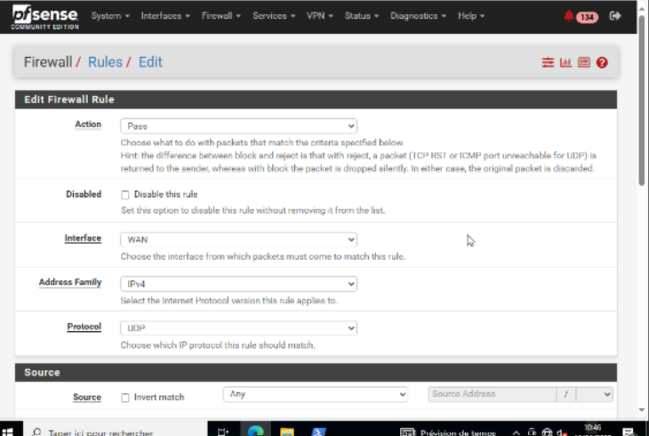

 

#### OpenVPN :
- **Accès :** Firewall > Rules > OpenVPN

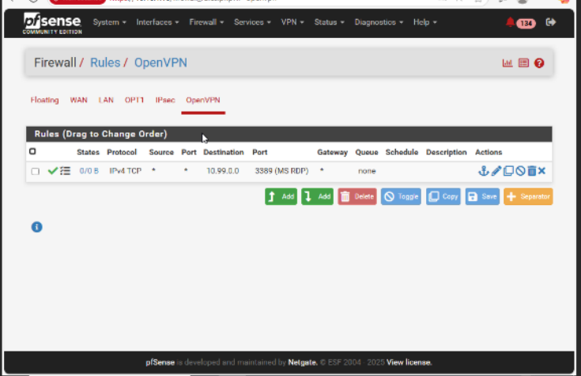

 

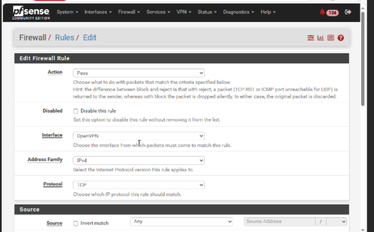

 

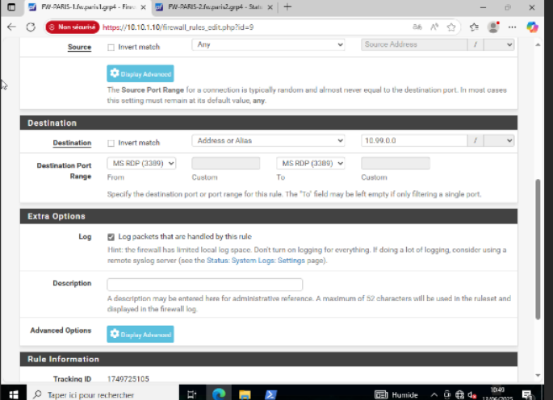