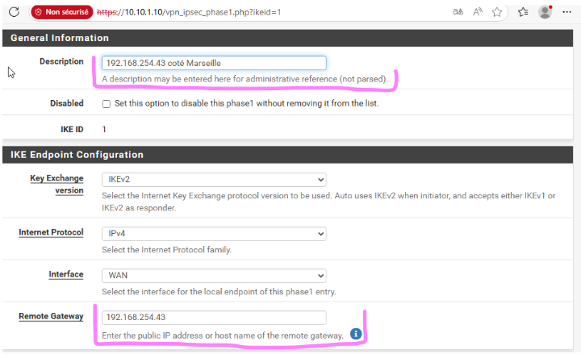
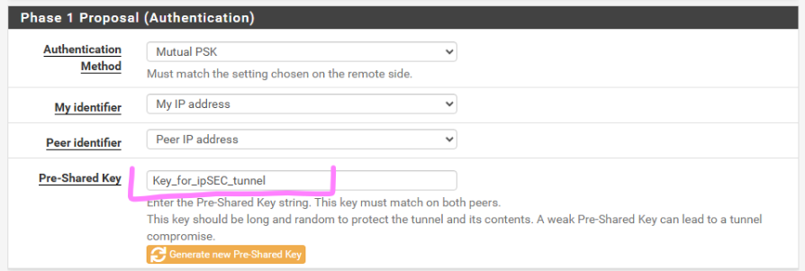
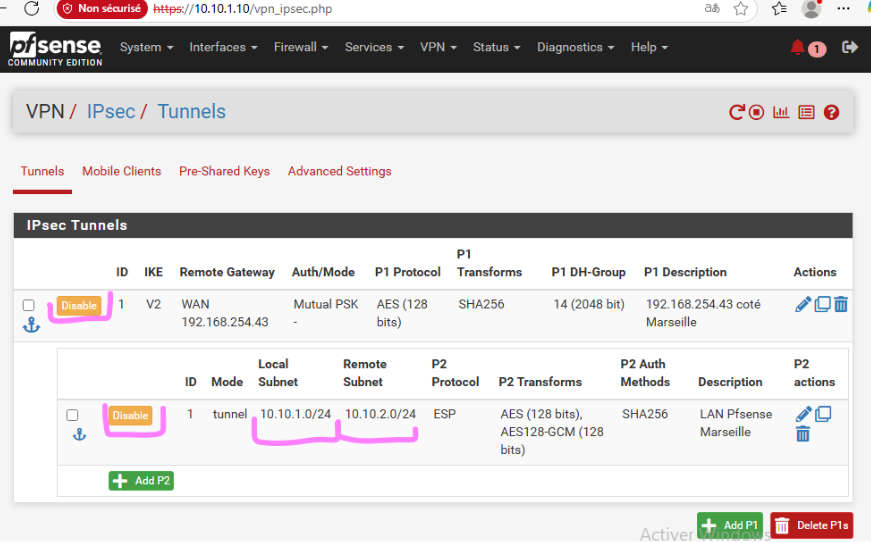
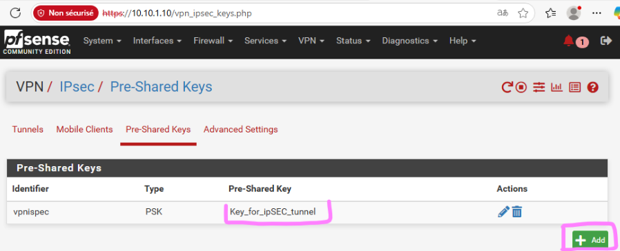
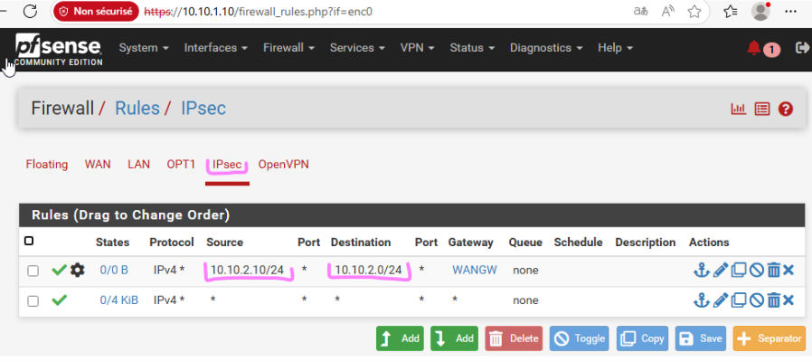
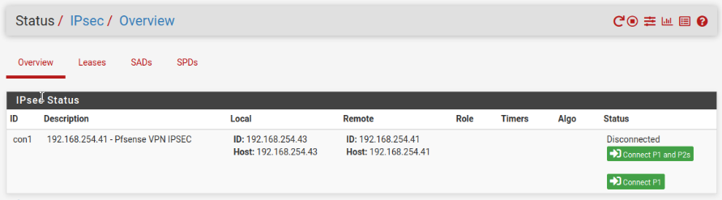
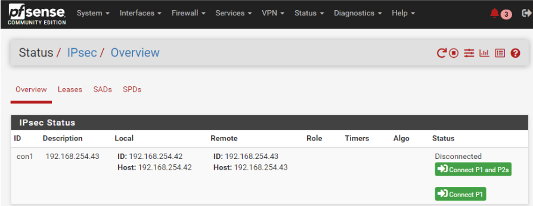
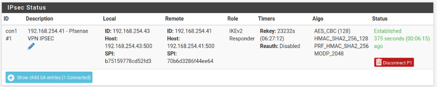
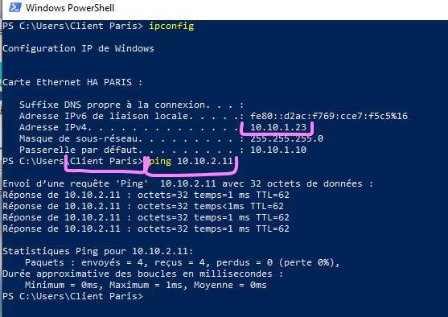

# 🔛 VPN site-to-site 

##  🎯 Objectif 

Le principal objectif de ce VPN est d'assurer une **sécurisation complète des communications entre les deux sites**, qui sont connectés via un réseau IP non sécurisé (Internet). En l'absence de VPN, les échanges de données entre Paris et Marseille circuleraient en clair sur le réseau public, exposant ainsi les informations sensibles à d’éventuelles interceptions. 

Ce VPN est implémenté en mode site-to-site, en utilisant le protocole IPsec avec `chiffrement AES-256`, authentification par clé pré-partagée et contrôle d’intégrité des échanges. 

**Le tunnel VPN garantit :**  

- la confidentialité des échanges grâce au chiffrement des paquets IP,   
- l’authentification de l’extrémité distante, afin de s'assurer que les communications proviennent bien du site autorisé,   
- l’intégrité des données pour empêcher toute altération des paquets lors de leur transmission. 

> En complément de cet aspect sécuritaire, le VPN inter-sites permet de relier les réseaux locaux (LAN) des deux sites de manière contrôlée et cloisonnée. Seuls les flux nécessaires au fonctionnement des services internes de l’entreprise transitent par ce tunnel sécurisé. 

## Mise en place du VPN inter-sites 

Les prérequis pour l’installation de ce vpn IPsec est d’avoir **les firewalls** présents et fonctionnels  sur les deux sites **Paris** et **Marseille** avec la bonne configuration réseau. 

Pour commencer, nous allons l’activer dans `VPN > IPsec`  
Sur celui de Paris, nous allons renseigner la passerelle de Marseille et inversement

  

Nous allons ensuite générer une clé pour ensuite la renseigner sur l’autre vpn pour que la connexion se fasse.  

  

Une fois que la phase une du VPN IPsec est terminée, on passe à la phase deux.  

  

Une fois que nous l’avons générée, il faut la mettre dans : **PSK** afin de l’activer.  

> 💡 **Point info** : Un PSK, ou "Pre-Shared Key" (clé pré-partagée en français), est un mot de passe ou une phrase secrète partagée à l'avance entre les parties qui souhaitent communiquer de manière sécurisée.

> ⚠️ Attention : la clé doit être exactement la même d’un firewall à un autre. 

  

Je vais ajouter une règle dans IPsec. `Firewall > Règles > IPsec `

Cette règle est ajoutée dans le pfsense de Paris. Elle va service à montrer le chemin entre la carte réseau de pfsense du côté lan et le réseau lan de Marseille. (Nous faisons pareil pour le firewall de Paris HA et PFsense Marseille) 

  

Dans la partie : `Status >  IPsec > Overview `

  

 

Dans la capture ci- dessous, nous pouvons voir que le VPN IPsec est bien monté entre les deux sites.  

  

# 📝 Partie Recettage VPN IPsec 

Pour tester le bon fonctionnement de notre VPN IPsec, nous allons ping depuis le **client Paris 10.10.1.23** le **client Marseille 10.10.2.11.** 
Le ping passe, les collaborateurs présent sur le site de Paris peuvent maintenant communiquer avec ceux de Marseille en toute sécurité.   

  

