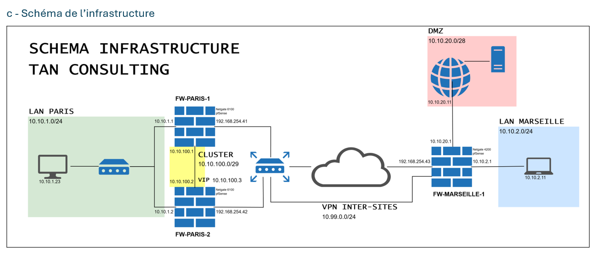

# 🌐 Plan d'adressage IP
## Infrastructure prévue
### 📍 Adresses publiques WAN
Les adresses publiques WAN sont fournies par le client.
La plage d’adresses allouée est : `192.168.254.40` à `192.168.254.49`.

| Adresse IP     | Attribution                           |
| -------------- | ------------------------------------- |
| 192.168.254.41 | Pare-feu Paris 1 (FW-PARIS-1)         |
| 192.168.254.42 | Pare-feu Paris 2 (FW-PARIS-2)         |
| 192.168.254.43 | Pare-feu Marseille 1 (FW-MARSEILLE-1) |

## 🏢 LAN Paris
Réseau : `10.10.1.0/24`

Utilisation : Réseau interne des utilisateurs du site de Paris.

**Pourquoi un masque /24 ?**  
>Le masque `/24` permet de disposer de 254 adresses IP utilisables.
Cela est adapté au nombre d’utilisateurs (environ 150 collaborateurs) et aux équipements réseau associés (imprimantes, téléphones IP, etc.).

## 🏙️ LAN Marseille
Réseau : `10.10.2.0/24`

Utilisation : Réseau interne des utilisateurs du site de Marseille.

**Pourquoi un masque /24 ?**
>Même si le nombre d’utilisateurs est plus restreint à Marseille, l’usage d’un masque /24 permet de conserver une cohérence d’architecture et d’anticiper de futures évolutions ou ajouts d’équipements.

## 🌐 DMZ Marseille
Réseau : `10.10.20.0/24`

Utilisation : Réseau dédié à l’Extranet de Marseille.

**Pourquoi un masque /24 ?**  
> Le masque `/24` est utilisé pour offrir une marge d’évolution importante si plusieurs services ou serveurs devaient être ajoutés dans la DMZ à l’avenir.

## 🔁 Réseau de Cluster des pare-feux (Paris)
Réseau : `10.10.100.0/29`

Utilisation : Synchronisation HA (Haute Disponibilité) entre les deux pare-feux de Paris et gestion de l’adresse IP virtuelle (VIP).

**Pourquoi un masque /29 ?**  
> Un masque `/29` permet de disposer de 6 adresses IP utilisables.
Ce réseau ne nécessite que 3 adresses : une pour chaque pare-feu (actif et passif) et une pour la VIP. Les adresses restantes offrent une marge de sécurité si une extension minime est nécessaire.

 

 

# 📋 Tableau d’adressage IP

| Sous-réseau              | Adresse-réseau | Masque | Plage d’adresses utilisables    | Usage prévu                                 |
| ------------------------ | -------------- | ------ | ------------------------------- | ------------------------------------------- |
| WAN (fourni)             | 192.168.254.0  | /24    | 192.168.254.40 → 192.168.254.49 | Interfaces WAN des sites Paris et Marseille |
| LAN PARIS                | 10.10.1.0      | /24    | 10.10.1.10 → 10.10.1.200        | Réseau interne utilisateurs PARIS           |
| LAN MARSEILLE            | 10.10.2.0      | /24    | 10.10.2.10 → 10.10.2.100        | Réseau interne utilisateurs MARSEILLE       |
| DMZ MARSEILLE            | 10.10.20.0     | /28    | 10.10.20.2 → 10.10.20.14        | Serveur Web                                 |
| CLUSTER FW PARIS (HA)    | 10.10.100.0    | /29    | 10.10.100.1 → 10.10.100.3       | Synchronisation HA et VIP                   |
| VPN Client-to-Site PARIS | 10.99.0.0      | /24    | 10.99.0.10 → 10.99.0.100        | Clients distants de Paris                   |

 

 

# 📂 Détails des sous-réseaux

| Site / Fonction          | Sous-réseau   | Masque | Plage utilisable | Gateway         | Broadcast       | Usage / Remarques                                        |
| ------------------------ | ------------- | ------ | ---------------- | --------------- | --------------- | -------------------------------------------------------- |
| WAN (fourni)             | 192.168.254.0 | /24    | .40 → .49        | 192.168.254.254 | 192.168.254.255 | WAN Paris 1: .41 / WAN Paris 2: .42 / WAN Marseille: .43 |
| LAN PARIS                | 10.10.1.0     | /24    | .1 → .254        | 10.10.1.1       | 10.10.1.255     | .1 = GW / DHCP de .10 à .200                             |
| LAN MARSEILLE            | 10.10.2.0     | /24    | .1 → .254        | 10.10.2.1       | 10.10.2.255     | DHCP : .100 à .200                                       |
| DMZ MARSEILLE            | 10.10.20.0    | /28    | .1 → .14         | 10.10.20.1      | 10.10.20.15     | FW / Web DMZ : 10.10.20.11                               |
| CLUSTER FW PARIS (HA)    | 10.10.100.0   | /29    | .1 → .6          | 10.10.100.1     | 10.10.100.7     | FW Paris 1 : .1 / FW Paris 2 : .2 / VIP : .3             |
| VPN Client-to-Site PARIS | 10.99.0.0     | /24    | .1 → .254        | 10.99.0.1       | 10.99.0.255     | Pool VPN Client (OpenVPN)                                |

 

# 📈 Schéma de l'infrastructure 

